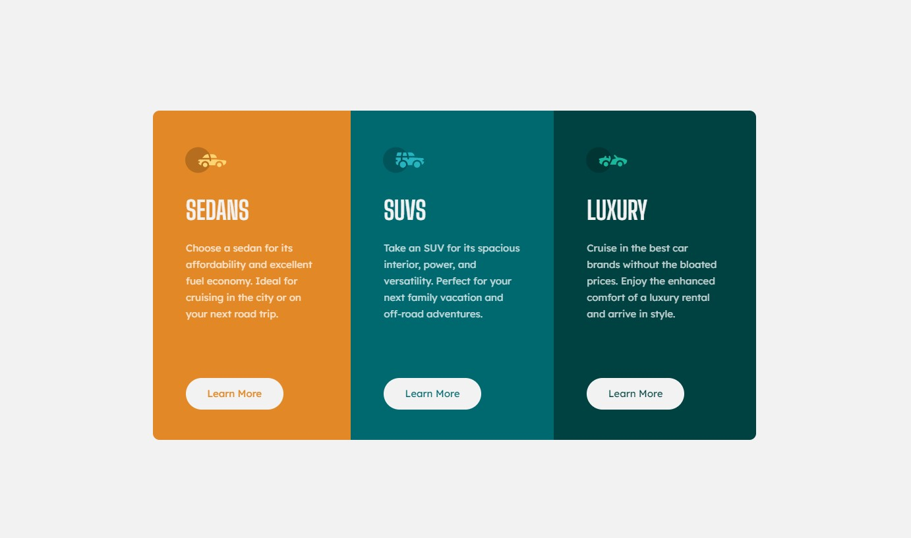

# Frontend Mentor - 3-column preview card component solution

This is a solution to the [3-column preview card component challenge on Frontend Mentor](https://www.frontendmentor.io/challenges/3column-preview-card-component-pH92eAR2-).

## Table of contents

- [Overview](#overview)
  - [The challenge](#the-challenge)
  - [Screenshot](#screenshot)
  - [Links](#links)
- [My process](#my-process)
  - [Built with](#built-with)
  - [What I learned](#what-i-learned)

## Overview

### The challenge

Users should be able to:

- View the optimal layout depending on their device's screen size
- See hover states for interactive elements

### Screenshot

#### Desktop

#### Mobile

#### Hover States

### Links

- Solution URL: https://a-stepanian.github.io/3-Column-Preview-Card-Component/

## My process

### Built with

- Semantic HTML5 markup
- CSS custom properties
- Flexbox
- Mobile-first workflow - coded the mobile layout first and used the media query for the desktop version.

### What I learned
- Time estimating - This is the first time I estimated how long it would take to build out a component.  It took just over an hour and I estimated it would take about an hour an a half.  I assumed there would be more things I would need to research to complete the task but most of the features of this componenent were actually straight forward and didn't require any additional research.  With the exception of...
- overflow: hidden will prevent child elements from overriding the parent element's border radius.  This definitely made styling much simpler and would have been useful on the last assignment.